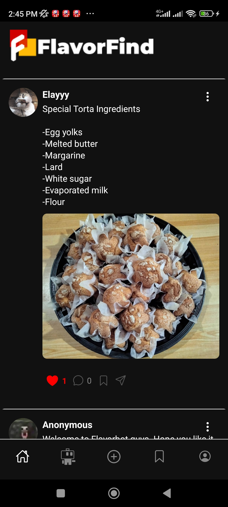
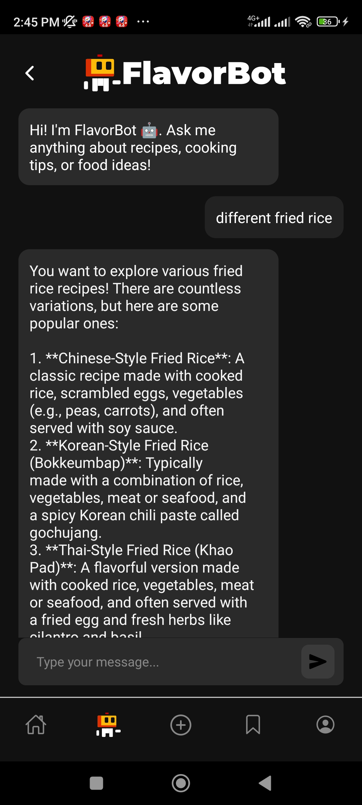
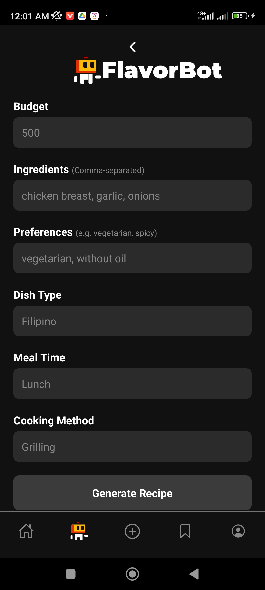

“FlavorShare – A mobile recipe sharing app where users can post, like, comment, save, and get AI-recommended recipes via Flavorbot.”

## Problem
“People often share recipes across multiple platforms like Messenger, Instagram, or Facebook groups. There’s no focused space for community-driven recipe sharing that also gives AI-powered suggestions.”

## Solution
“We built FlavorFind to solve this by combining a social feed with an AI chatbot that helps users discover and create new recipes based on ingredients, preferences, or cuisine.”

## Key Features
User registration/login (Firebase Auth)

Create and view recipes with images

Like, comment, save, and share posts

Flavorbot chat to suggest recipes

Mobile-first design (React Native + Expo)

## Tech Stack
React Native (Expo), Firebase (Auth, Firestore, Storage), Cloudinary, Groq API (for Flavorbot)

Uploading images was challenging because storing pictures in Firestore incurs costs. To address this, I used Cloudinary for image storage. Implementing likes and comments was also difficult; in hindsight, I wish I had planned these features more thoroughly before coding.

## What I Learned
Working with Firebase taught me about real-time data handling and mobile data constraints. I also learned how to integrate AI features via an LLM.

## Screnshots and Demo Link
📸 
📸 
📸 
🔗 Add your GitHub repo or Expo link if available.

## Future Improvements
“I plan to add recipe search by ingredient, offline access, short videos, post privacy, profile viewing, and regional language support.”

## Credits
- UI inspired by [Threads Mobile app](https://www.threads.net/)
- Original UI design by [Voltaire Jan Punzalan](https://www.facebook.com/voltairejan.punzalan)
